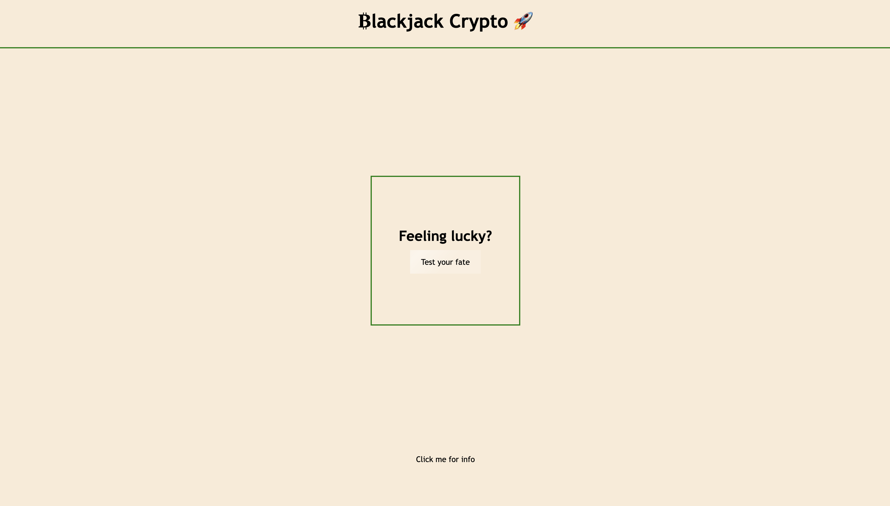
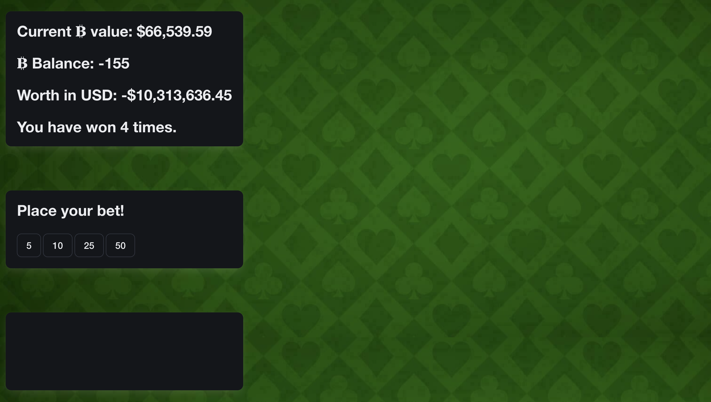
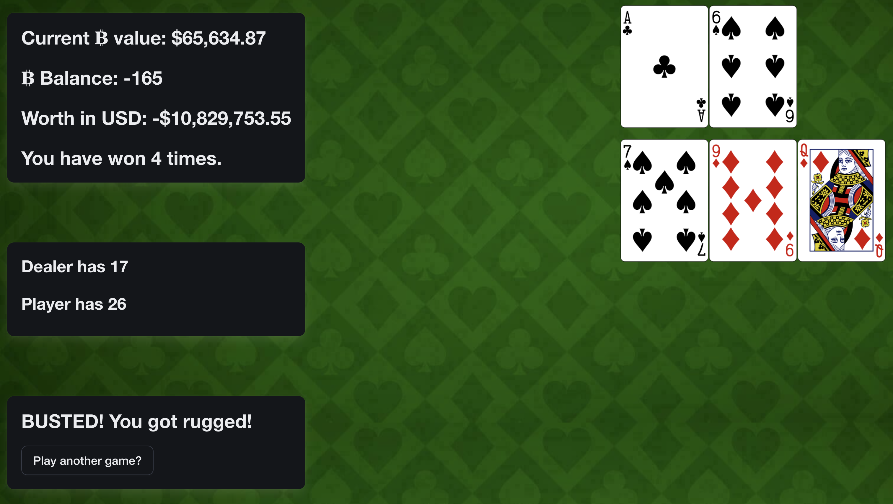
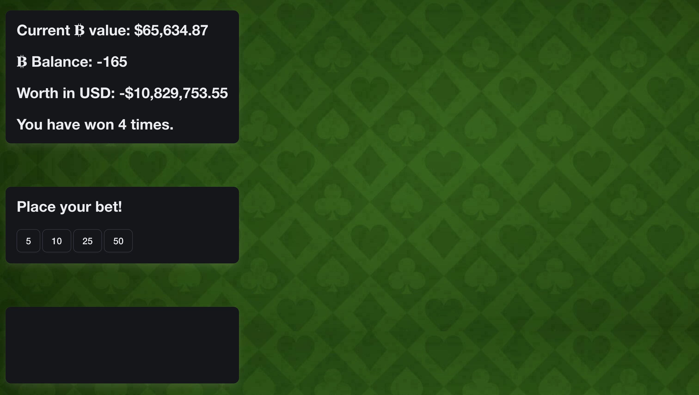

# ₿lackjack-crypto 🚀

At the conclusion of each phase of this course, you’ll work with a group of your fellow students to create a **project**. A project is collaborative work among a group of developers to create an application that solves a real-world problem. Projects model the experience you’ll encounter in every development role at any company, from large multinational businesses to small startups. Coding is collaborative.

A project is a bit different from the Challenge assignments you’ve worked on so far. One of the biggest differences is that you’ll no longer build an application by yourself! This has some advantages&mdash;you won’t have to do all of the work, you can divide up duties, and you can share skills and knowledge with other developers and lean on their strengths. This can also be challenging if you’re used to working alone. Constant communication and time management are just two of the skills you’ll need to practice to make sure everyone in your group works together to complete the project. 

Finally, a project requires a presentation, because you’re trying to convince an audience that it serves a purpose. Your instructional staff and fellow students are investors, and you’re pitching your creation to them&mdash;an experience that developers are required to do frequently. Your presentation is just as important as the actual project, so take it just as seriously.

## Project Requirements
* ** Additions marked with double asterisk

You and your group will use everything you’ve learned over the past six modules to create a real-world front-end application that you’ll be able to showcase to potential employers. The user story and acceptance criteria will depend on the project that you create, but your project must fulfil the following requirements:
* Use a CSS framework other than Bootstrap.
* ** We used Bulma 
* Be deployed to GitHub Pages.
* Be interactive (i.e., accept and respond to user input).
* Use at least two [server-side APIs](https://coding-boot-camp.github.io/full-stack/apis/api-resources).
* ** https://deckofcardsapi.com/ - blackjack api 
* ** https://min-api.cryptocompare.com/ - cryptocurrency api 
* Must include one modal. It does not use native browser alert, confirm, or prompt functionality. 
* ** "Organic" (non-framework) modal on landing page 
* Use client-side storage to store persistent data.
* ** Stored wins and losses plus game data and currency data 
* Be responsive.
* Have a polished UI.
* Have a clean repository that meets quality coding standards (file structure, naming conventions, follows best practices for class/id naming conventions, indentation, quality comments, etc.).
* Have a quality README (with unique name, description, technologies used, screenshot, and link to deployed application).

## Presentation Requirements

* Elevator pitch: a one minute description of your application
* Concept: What is your user story? What was your motivation for development?
* Process: What were the technologies used? How were tasks and roles broken down and assigned? What challenges did you encounter? What were your successes?
* Demo: Show your stuff!
* Directions for Future Development
* Links to the deployed application and the GitHub repository

## PROJECT STORY:

For this project, on day one, Chris and Ryan hashed out the idea to do blackjack crypto as Lily was absent and our fourth dropped the class. On day one, Chris acquired links to the api's we would call and began coding the JavaScript portion meanwhile Ryan made the repo and wireframe. Day two, Chris and Ryan got Lily up to speed and then they were all off to the races. Ryan tackled the html, css and JavaScript of landing page between day two and three. Lily did some field research on day two plus began making the gameplay page. On day three, she pretty well got the structure of the gameplay page completed and began stylizing. Chris tackled the bulk of the JavaScript from day one to three as he was most versed in it amongst the three members. On day four, Chris worked out the bugs of the gameplay page while Ryan made the presentation and added to readme. Lily polished the UI for the gameplay page on day 4.

Struggles encountered during the building process mostly related to the JavaScript portion for gameplay. Primarily, it was just a matter of placement for variables or given portions of functions that needed to be relocated for things to work. Additionally, there were some styling bugs with Bulma. To conquer that, I believe Lily just had to find the proper link for Bulma integration and then adjusted id's as well as classes per given code snippet. 

## TECHNOLOGIES USED:

We used bulma, css, git, github, google slides, html, javascript, and vs code to build this project.

## LINKS:

* Github repo link: https://github.com/shyanrafer/blackjack-crypto
* Deployed page link: https://shyanrafer.github.io/blackjack-crypto/

## SCREENSHOTS:

